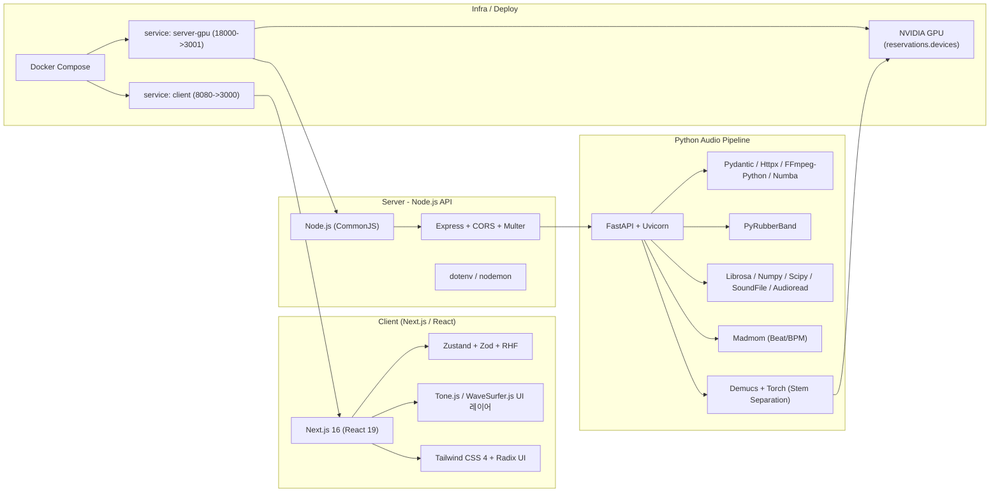
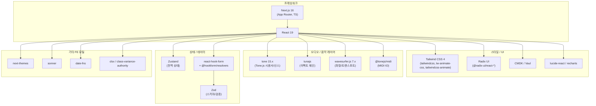
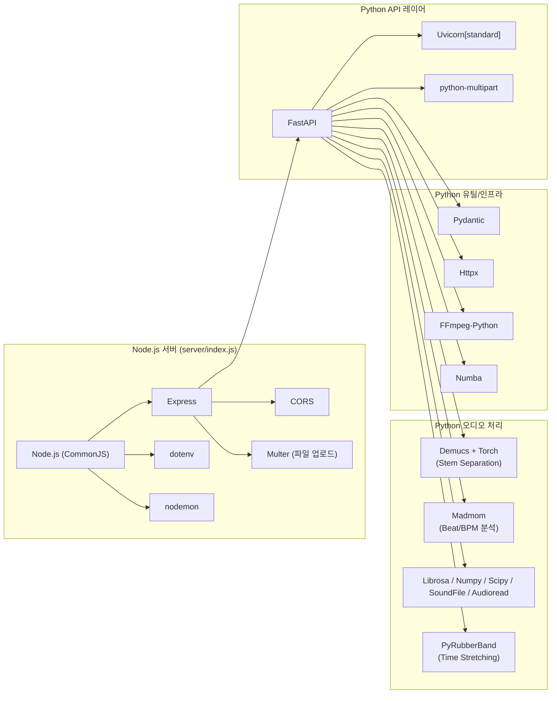
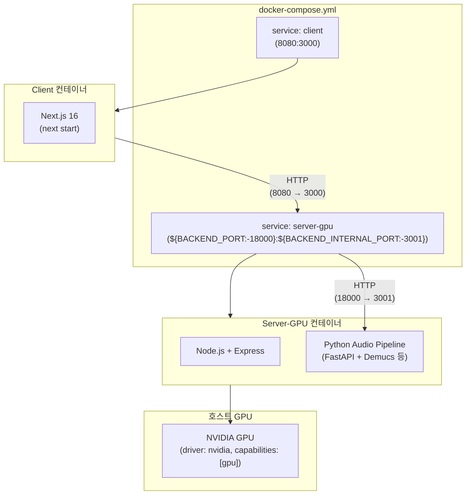

# Web DAW Project

이 프로젝트는 Next.js 기반의 프론트엔드와 Python/Node.js 하이브리드 백엔드로 구성된 웹 기반 DAW(Digital Audio Workstation)입니다. Docker 및 GPU 환경을 활용하여 간편하게 실행할 수 있습니다.

## 주요 기능

- **Stem Separation**: Demucs를 활용한 오디오 소스 분리 (Vocals, Drums, Bass, Other).
- **Audio Analysis**: Madmom, BeatNet을 이용한 비트 및 BPM 분석.
- **Transition Mixing**: AI 기반의 이종 곡 간 자동 믹싱.
- **Interactive UI**: 트랙 관리, 파형 시각화, 실시간 오디오 제어.

## 실행 방법 (Docker 활용)

이 프로젝트는 Client와 Server를 포함한 전체 시스템을 Docker Compose로 한 번에 실행할 수 있도록 구성되어 있습니다.

### 1. 전체 아키텍처 개요 (Client / Server / GPU / 오디오 파이프라인)



---

### 2. 프론트엔드 상세 (UI / 오디오 / 상태)



---

### 3. 백엔드 상세 (Python 오디오 파이프라인 + Node.js 서버)



---

### 4. 인프라 / Docker Compose / GPU 구성



### 사전 요구 사항

- [Docker Desktop](https://www.docker.com/products/docker-desktop/) 설치 및 실행

### 설치 및 실행

1. **저장소 클론**

   ```bash
   git clone <repository-url>
   cd madcamp4-daw-project
   ```

2. **Docker Compose 실행**
   프로젝트 루트 디렉토리에서 다음 명령어를 실행합니다.

   ```bash
   docker-compose up --build
   ```

   _참고: Server 이미지 빌드 시 Python 의존성 설치로 인해 최초 실행 시 시간이 소요될 수 있습니다._

3. **접속 (기본 포트)**
   - **Client (Web App)**: [http://localhost:8080](http://localhost:8080)  
     - `docker-compose.yml` 기준: 호스트 `8080` → 컨테이너 `client:3000`
   - **Server (API)**: [http://localhost:18000](http://localhost:18000)  
     - `docker-compose.yml` 기준: 호스트 `${BACKEND_PORT:-18000}` → 컨테이너 `server-gpu:${BACKEND_INTERNAL_PORT:-3001}`

## 프로젝트 구조

- **client/**: Next.js 프론트엔드 애플리케이션
- **server/**: Python(Audio Processing) 및 Node.js 백엔드 서버
- **docker-compose.yml**: 전체 서비스 오케스트레이션 설정

## 기술 스택

### 프론트엔드 (client)

- **프레임워크**
  - Next.js 16 (App Router, TypeScript)
  - React 19
- **스타일 / UI**
  - Tailwind CSS 4 (`tailwindcss`, `@tailwindcss/postcss`, `tw-animate-css`, `tailwindcss-animate`)
  - Radix UI 컴포넌트 (`@radix-ui/react-*`, `cmdk`, `vaul`)
  - 아이콘 및 차트: `lucide-react`, `recharts`
- **오디오 / 음악**
  - `tone` 15.x (Tone.js 기반 신스/시퀀서)
  - `tunajs` (이펙트 체인)
  - `wavesurfer.js` 7.x (파형 시각화 및 트랜스포트)
  - `@tonejs/midi` (MIDI 입/출력)
- **상태 / 데이터**
  - `zustand` (상태 관리)
  - `zod` (스키마·검증)
  - `react-hook-form` + `@hookform/resolvers`
- **기타**
  - `next-themes`, `sonner`, `date-fns`, `clsx`, `class-variance-authority`

### 백엔드 (Python / Node.js)

- **Python 오디오 파이프라인 (client/backend, server 내 Python 코드)**
  - 웹 프레임워크: `fastapi`, `uvicorn[standard]`, `python-multipart`
  - Stem Separation: `demucs`, `torch`
  - Beat/BPM 분석: `madmom`
  - 오디오 I/O/분석: `librosa`, `numpy`, `soundfile`, `scipy`, `audioread`
  - 타임 스트레칭: `pyrubberband`
  - 유틸리티: `pydantic`, `httpx`, `ffmpeg-python`, `numba`
- **Node.js 서버 (server/index.js)**
  - 런타임: Node.js (CommonJS)
  - 웹 프레임워크: `express`
  - 기타: `cors`, `multer`(파일 업로드), `dotenv`, `nodemon`

### 인프라 / 배포

- Docker, Docker Compose
- `docker-compose.yml`를 통한 멀티 컨테이너 구성
  - `client`: Next.js 프론트엔드 (포트 8080 → 3000)
  - `server-gpu`: Node.js + Python 오디오 파이프라인 (포트 18000 → 3001)
- NVIDIA GPU 리소스 예약 (Compose `deploy.resources.reservations.devices` + `driver: nvidia`)

## API 연동 정보

Docker Compose 환경에서는 다음과 같이 설정되어 연동됩니다. (`docker-compose.yml`의 환경 변수 기준)

- **Stem Separation API**: `http://localhost:18000/api/stems`  
  - `NEXT_PUBLIC_STEM_API_URL=http://localhost:18000/api/stems`
- **Transition API**: `http://localhost:18000/api/transition`  
  - `NEXT_PUBLIC_TRANSITION_API_URL=http://localhost:18000/api/transition`

## 문제 해결

- **빌드 오류**: Docker Desktop이 실행 중인지 확인하고, 인터넷 연결 상태를 점검하세요.
- **포트 충돌**: 3000번 또는 8000번 포트가 이미 사용 중이라면 `docker-compose.yml`에서 포트 매핑을 수정하세요.
