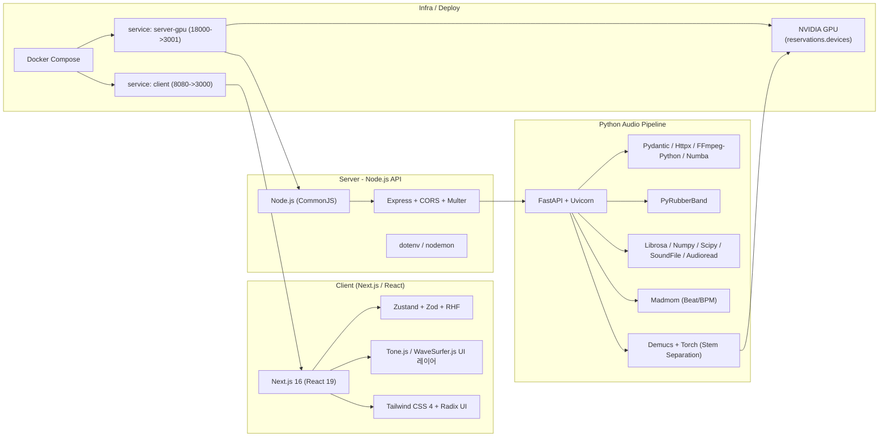
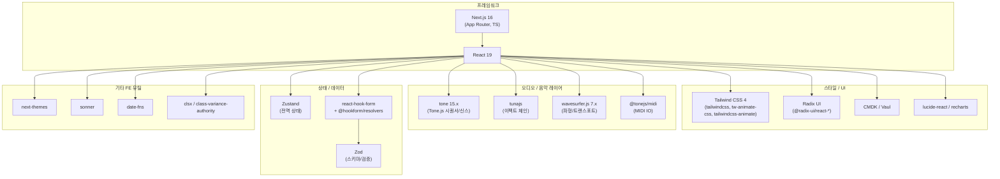
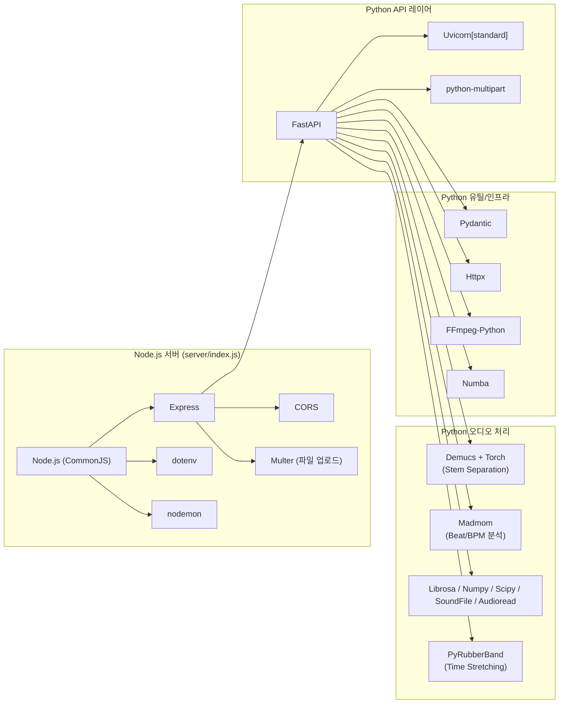
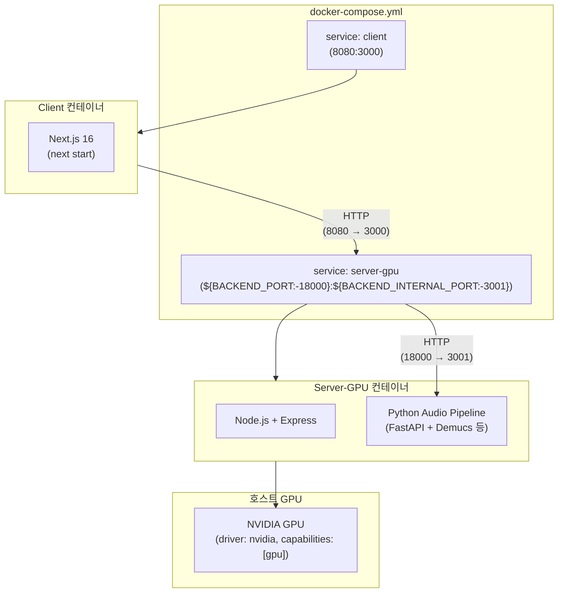

## 기술 스택 아키텍처 다이어그램

### 1. 전체 아키텍처 개요 (Client / Server / GPU / 오디오 파이프라인)

---

### 2. 프론트엔드 상세 (UI / 오디오 / 상태)

---

### 3. 백엔드 상세 (Python 오디오 파이프라인 + Node.js 서버)

---

### 4. 인프라 / Docker Compose / GPU 구성

