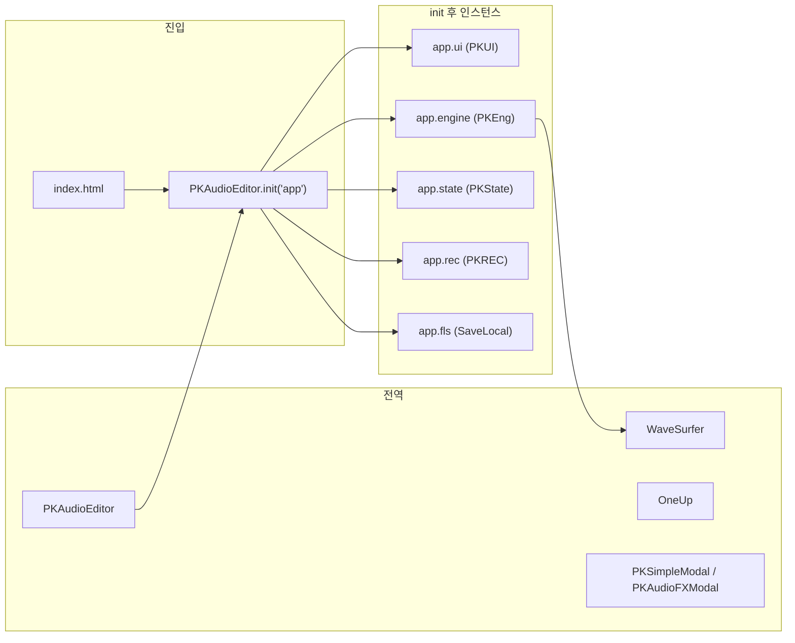
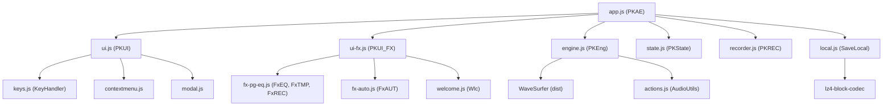

# AudioMass 전체 분석 문서

**버전**: 0.9 (AudioMass _v 기준)  
**분석 일자**: 2025-01-31  
**대상 경로**: `AudioMass/src/`

---

## 목차

1. [디렉터리 트리 구조](#1-디렉터리-트리-구조)
2. [스크립트 로드 순서와 _deps 맵](#2-스크립트-로드-순서와-_deps-맵)
3. [전역 객체·진입 호출 관계](#3-전역-객체진입-호출-관계)
4. [기술 스택 요약](#4-기술-스택-요약)
5. [모듈 의존성 다이어그램](#5-모듈-의존성-다이어그램)
6. [HTML 파일 분석](#6-html-파일-분석)
7. [앱 코어 JS 분석](#7-앱-코어-js-분석)
8. [UI·입력 JS 분석](#8-ui입력-js-분석)
9. [엔진·상태·액션 JS 분석](#9-엔진상태액션-js-분석)
10. [FX·EQ JS 분석](#10-fxeq-js-분석)
11. [저장·로컬 JS 분석](#11-저장로컬-js-분석)
12. [코덱·포맷 JS 분석](#12-코덱포맷-js-분석)
13. [welcome.js 분석](#13-welcomejs-분석)
14. [서버·PWA 분석](#14-서버pwa-분석)
15. [스타일·정적 자산](#15-스타일정적-자산)
16. [주요 이벤트 요약](#16-주요-이벤트-요약)
17. [구현 시 참고(구현 방향)](#17-구현-시-참고구현-방향)
18. [전체 함수·객체 인덱스](#18-전체-함수객체-인덱스)

---

## 1. 디렉터리 트리 구조

```
AudioMass/
├── README.md
└── src/
    ├── about/                    # 소개 페이지용 이미지·미디어
    │   ├── audiomass_2.jpg
    │   ├── audiomass_3.jpg
    │   ├── audiomass_4.jpg
    │   ├── audiomass_support.jpg
    │   ├── audiomass_top.jpg
    │   ├── dock_ui.mp4
    │   ├── fruity.png
    │   └── sonar.jpg
    ├── about.html                # 소개 페이지
    ├── actions.js                # AudioUtils (버퍼·다운로드·이펙트)
    ├── app.js                    # PKAE, PKAudioEditor 진입
    ├── audiomass-server.go       # Go 로컬 서버
    ├── audiomass-server.py       # Python 로컬 서버
    ├── audiomass.appcache        # AppCache 매니페스트
    ├── contextmenu.js            # 컨텍스트 메뉴 (contextMenu)
    ├── drag.js                   # 드래그 앤 드롭 (dragNDrop)
    ├── engine.js                 # PKEng, WaveSurfer 래핑
    ├── eq.html                  # 주파수 분석기 (iframe/독)
    ├── flac.js                   # FLAC 워커 인코딩 (Worker)
    ├── fonts/
    │   ├── icomoon.eot
    │   ├── icomoon.svg
    │   ├── icomoon.ttf
    │   └── icomoon.woff
    ├── fx-auto.js                # FxAUT (자동화)
    ├── fx-pg-eq.js               # FxEQ, FxTMP, FxREC (EQ·템포·녹음 모달)
    ├── ico.png, icon.png
    ├── id3.js                    # ID3v2/ID4 메타데이터
    ├── index-cache.html          # AppCache용 진입 HTML
    ├── index.html                # 메인 앱 진입
    ├── keys.js                   # KeyHandler
    ├── lame.js                   # MP3 인코딩 (lamejs)
    ├── libflac.js                # FLAC WASM 바인딩
    ├── libflac.wasm
    ├── local.js                  # SaveLocal (IndexedDB, LZ4)
    ├── lz4-block-codec-wasm.js   # LZ4 블록 WASM 래퍼
    ├── lz4-block-codec.wasm
    ├── lzma.js                   # LZMA 압축 해제 (로드만)
    ├── main.css                  # 앱 전역 스타일
    ├── manifest.json             # PWA 매니페스트
    ├── modal.js                  # PKSimpleModal, PKAudioFXModal
    ├── oneup.js                  # OneUp 토스트
    ├── phone-switch.jpg          # welcome 모바일 팁 이미지
    ├── test.mp3                  # LoadSample 데모·sw/appcache 캐시용
    ├── recorder.js               # PKREC (마이크 녹음)
    ├── rnn_denoise.js            # RNN 디노이즈 WASM (Module)
    ├── rnn_denoise.wasm
    ├── sp.html                  # 스펙트럼 분석기 (iframe/독)
    ├── state.js                  # PKState (Undo/Redo)
    ├── sw.js                     # Service Worker
    ├── ui-fx.js                  # PKUI_FX (이펙트 UI)
    ├── ui.js                     # PKUI (메인 UI)
    ├── wav.js                    # WAV 인코딩 (Worker)
    ├── welcome.js                # Wlc (웰컴 모달)
    └── dist/                     # 서드파티 빌드
        ├── wavesurfer.js
        └── plugin/
            └── wavesurfer.regions.js
```

---

## 2. 스크립트 로드 순서와 _deps 맵

index.html의 `<script>` 로드 순서와 `PKAudioEditor._deps`에 등록되는 키:

| 순서 | 파일 | _deps 키 | 비고 |
|------|------|----------|------|
| 1 | dist/wavesurfer.js | — | 전역 `WaveSurfer` |
| 2 | dist/plugin/wavesurfer.regions.js | — | `WaveSurfer.regions` |
| 3 | oneup.js | — | 전역 `OneUp` |
| 4 | app.js | — | `PKAudioEditor`(PKAE), `PKAudioList` |
| 5 | keys.js | `keyhandler` | KeyHandler 생성자 |
| 6 | contextmenu.js | `ContextMenu` | contextMenu 생성자 |
| 7 | ui-fx.js | `uifx` | PKUI_FX 함수(호출 시 UI-FX 설정) |
| 8 | ui.js | `ui` | PKUI 생성자 |
| 9 | modal.js | — | 전역 `PKSimpleModal`, `PKAudioFXModal` |
| 10 | state.js | `state` | PKState 생성자 |
| 11 | engine.js | `engine` | PKEng 생성자 |
| 12 | actions.js | `audioutils` | AudioUtils 생성자 |
| 13 | drag.js | — | 전역 `dragNDrop` |
| 14 | recorder.js | `rec` | PKREC 생성자 |
| 15 | welcome.js | `Wlc` | 웰컴 모달 함수 |
| 16 | fx-pg-eq.js | `FxEQ`, `FxTMP`, `FxREC` | ParagraphicModal, TempoToolsModal, RecModal |
| 17 | fx-auto.js | `FxAUT` | FXAutomation 생성자 |
| 18 | local.js | `fls` | SaveLocal 생성자 |
| 19 | id3.js | — | 전역 `ID3v2`, `ID4` (engine에서 사용) |
| 20 | lzma.js | — | LZ4 블록 코덱 래퍼(동적 로드). LZ4BlockWASM/LZ4BlockJS, createInstance('wasm'\|'js'). 파일명은 lzma.js이나 내용은 LZ4용 |

---

## 3. 전역 객체·진입 호출 관계

- **진입**: `PKAudioEditor.init('app')` → `#app` 요소에 에디터 마운트.
- **init() 내부**: `q.ui = new q._deps.ui(q)`, `q._deps.uifx(q)`, `q.engine = new q._deps.engine(q)`, `q.state = new q._deps.state(4, q)`, `q.rec = new q._deps.rec(q)`, `q.fls = new q._deps.fls(q)`.
- **전역 노출**: `PKAudioEditor`(PKAE 인스턴스), `PKAudioList`, `WaveSurfer`, `OneUp`, `PKSimpleModal`, `PKAudioFXModal`, `dragNDrop`, `ID3v2`/`ID4`(id3.js).



---

## 4. 기술 스택 요약

| 구분 | 기술 |
|------|------|
| 언어 | JavaScript(ES5 스타일, IIFE), Go, Python |
| UI/오디오 | WaveSurfer (웨이브폼·리전), Web Audio API |
| 저장 | IndexedDB (sessions), LZ4 블록 압축(WASM) |
| 코덱/포맷 | WAV(Worker), FLAC(libflac.js + WASM), MP3(lamejs), ID3v2/ID4(id3.js) |
| WASM | libflac.wasm, lz4-block-codec.wasm, rnn_denoise.wasm |
| PWA/캐시 | manifest.json, audiomass.appcache, sw.js (등록 주석 처리) |
| 서버 | audiomass-server.go (5055), audiomass-server.py (5055) |

---

## 5. 모듈 의존성 다이어그램



---

## 6. HTML 파일 분석

### 6.1 index.html

- **역할**: 메인 앱 진입. `#app` 한 개, `main.css` 로드, 위 스크립트 순서로 모든 JS 로드 후 `PKAudioEditor.init('app')` 호출.
- **관계**: Service Worker 등록은 주석 처리됨.

### 6.2 eq.html

- **역할**: 주파수 분석기. 캔버스 기반 주파수 분석, `?iframe` 쿼리 시 iframe으로 로드되어 부모와 연동.
- **스크립트/스타일**: 인라인 스타일·인라인 스크립트. `window.update`, `dock()`, `remove()`, `drag(event)` 등으로 부모의 `PKAudioEditor.ui.Dock('RequestShowFreqAn','eq',…)`, `Dock('RequestDragI','eq')` 호출.
- **관계**: 메인 앱에서 "주파수 분석" 기능으로 iframe 또는 새 창으로 열림.
- **부모 연동**: 메인 앱이 `app.ui.Dock('RequestShowFreqAn', 'eq', [1, 1])` 또는 `Dock('RequestDragI', 'eq')` 등으로 이벤트를 보내 eq 창 표시·드래그 동작을 제어함.

### 6.3 sp.html

- **역할**: 스펙트럼 분석기. 구조는 eq.html과 유사, 캔버스에 스펙트럼 표시.
- **관계**: `PKAudioEditor.ui.Dock('RequestShowFreqAn','sp',…)` 등으로 메인과 연동.
- **부모 연동**: 메인 앱이 `app.ui.Dock('RequestShowFreqAn', 'sp', [1, 1])` 또는 `Dock('RequestDragI', 'sp')` 등으로 이벤트를 보내 sp 창 표시·드래그 동작을 제어함.

### 6.4 about.html

- **역할**: AudioMass 소개·문서 페이지. `about/` 이미지 참조, 외부 스크립트 없음.
- **관계**: 링크로만 접근, 메인 앱과 동일 도메인 정적 페이지.

### 6.5 index-cache.html

- **역할**: AppCache용 진입 HTML. `manifest="audiomass.appcache"` 지정, 스크립트 목록은 index.html과 동일. Service Worker 인라인 호출 없음.
- **관계**: 오프라인/캐시 전략에서 index 대신 사용할 수 있는 진입점.

---

## 7. 앱 코어 JS 분석

### 7.1 app.js

- **패턴**: IIFE, 전역에 `PKAudioEditor`, `PKAudioList` 노출.
- **PKAE (생성자)**  
  - `el`: 루트 DOM. `id`: 자동 증가. `_deps`: 주입된 모듈 저장.  
  - `fireEvent(eventName, value, value2)`: 해당 이벤트 구독자 배열 순회 호출.  
  - `listenFor(eventName, callback)`: 콜백을 해당 이벤트 배열 앞에 추가.  
  - `stopListeningFor` / `stopListeningForName`: 구독 제거.  
  - `init(el_id)`: `#app` 획득 후 `q._deps.ui`, `uifx`, `engine`, `state`, `rec`, `fls` 생성·할당. URL에 `local=` 있으면 `fls.Init` → `GetSession` → `engine.LoadDB` 로 세션 복원.
- **전역**: `w.PKAudioEditor = new PKAE()`, `PKAudioList.push(PKAudioEditor)`.

### 7.2 oneup.js

- **OneUp(_text, _time, _clss)**: 짧은 토스트 메시지. body에 div 추가, opacity/위치 애니메이션 후 제거. `w.OneUp = OneUp`.

---

## 8. UI·입력 JS 분석

### 8.1 ui.js

- **PKUI (생성자)**: 앱 메인 UI. `app._deps.keyhandler`로 KeyHandler 생성, 상단/하단 바·메인 뷰·툴바·메뉴 트리 구성. `Dock`, `Show`, `Hide`, `getOpenElement`, `openMenu`, `closeMenu` 등. 이벤트 리스너로 `StatePush`/`DidStateChange` 등 반영. 마지막에 `PKAE._deps.ui = PKUI` 등록.
- **InteractionHandler**: `app.ui.InteractionHandler` — 모달·드래그 등 "단일 포커스" 활성 시 다른 UI 입력 차단용. `on`, `by`, `arr`. `check(name)`: 현재 활성 주체가 name이 아니면 false. `checkAndSet(name)`: 통과 시 on/by 설정. `forceSet(name)` / `forceUnset(name)`: 스택처럼 이전 상태 보존·복원. 모달 열 때 `checkAndSet('modal')`, ondestroy에서 `on = false`.
- **Dock(id, arg1, arg2)**: `app.fireEvent(id, arg1, arg2)` 래퍼. eq/sp(주파수·스펙트럼 분석기) 연동 시 사용 이벤트: `RequestShowFreqAn`(url, args), `RequestDragI`(url). 메인 앱이 iframe/창을 열고 부모에서 `PKAudioEditor.ui.Dock('RequestShowFreqAn', 'eq'|'sp', [1,1])` 등으로 호출. 자세한 연동은 §6.2·§6.3 참고.
- **내부**: `_topbarConfig`, `_makeUITopHeader`, `build_menus`, `_makeUIBarBottom`, `_makeUIMainView`, `_makeUIToolbar`, `_makeMobileScroll`, `formatTime` 등. 컨텍스트 메뉴는 `PKAudioEditor._deps.ContextMenu(avv)` 사용.

### 8.2 ui-fx.js

- **PKUI_FX(app)**: 이펙트 관련 UI 초기화. `PKAudioEditor._deps.FxEQ`, `FxTMP`, `FxREC` 호출로 EQ·템포·녹음 모달 등록. `PKAE._deps.uifx = PKUI_FX`.

### 8.3 modal.js

- **PKSimpleModal(config)**: 범용 모달. config: title, clss, body, buttons, toolbar, setup, ondestroy 등. `Show()`, `Destroy()`.
- **PKAudioFXModal(config, app)**: 이펙트용 확장 모달. Preview ON/OFF, 프리셋, `RequestActionFX_*` 이벤트 연동. 내부에서 PKSimpleModal 인스턴스 생성.

### 8.4 keys.js

- **KeyHandler()**: keyMap, callbacks, singleCallbacks. `addCallback(name, fn, keys)`, `addSingleCallback`, `removeCallback`. keydown/keyup/keypress 리스너, contextmenu 기본 동작 방지. `PKAE._deps.keyhandler = KeyHandler`.

### 8.5 contextmenu.js

- **contextMenu(elem, options)**: 옵션 배열로 메뉴 항목 추가. `open`, `close`, `openWithToken`, `destroy`, `addOption`. `pk_ctxmn` 이벤트로 열기. `PKAE._deps.ContextMenu = contextMenu`.

### 8.6 drag.js

- **dragNDrop(body, overlay_id, callback, method, _clss)**: 파일 드래그 앤 드롭. FileReader로 읽기(method: text/binary/arrayBuffer). 이벤트: dragenter, dragleave, dragover, drop. 전역에만 노출, _deps에는 없음.

---

## 9. 엔진·상태·액션 JS 분석

### 9.1 engine.js

- **PKEng(app)**: WaveSurfer 인스턴스 생성(컨테이너 `#pk_av_`+app.id), regions 플러그인 사용. 내부에 `AudioUtils = new app._deps.audioutils(app, wavesurfer)`.
- **공개 메서드**: `TrimTo`, `LoadArrayBuffer`, `LoadDB`, `LoadFile`, `DownloadFile`, `LoadSample`, `LoadURL`, `GetCopyBuff`, `GetSel`, `PlayBuff`, `GetFX`, `GetWave`, `ID3`.  
- **LoadSample**: 180ms 후 `wavesurfer.load('test.mp3')` 호출. 데모용 샘플 로드. test.mp3는 sw/appcache 캐시 대상(§1·§15 참고).
- **RequestActionFX_NoiseRNN**: ui.js에서 `RequestActionFX_NoiseRNN` 발행 시 engine.js가 구독. 최초 1회 동적 `<script src="rnn_denoise.js">` 로드 후 Module 준비 대기. 선택 리전(없으면 전체) 구간에 대해 채널별 `wasm_denoise_stream_perf` 적용 → `AudioUtils.Replace`로 버퍼 교체, `StateRequestPush`·`RequestSeekTo`·리전 재설정·`OneUp('Applied Noise RNN (fx)')` 호출. rnn_denoise.js 연동은 §12 참고.
- **이벤트**: `RequestZoomUI`, `RequestCancelModal`, `WillDownloadFile`, `DidDownloadFile`, `RequestSeekTo` 등 구독·발행.  
- **TimeStretcher**: 내부 프로토타입으로 `stretch`, `_hannWindow`, `_findBestMatch`, `_normalizeOutput`.  
- **ID3**: arraybuffer에서 ID3v2/ID4 파싱 후 `RequestActionID3` 발행.  
- **등록**: `PKAE._deps.engine = PKEng`.

### 9.2 state.js

- **PKState(_depth, app)**: Undo/Redo 스택. `_depth`(기본 4)만큼 undo_state_list 유지.  
- **메서드**: `getLastUndoState`, `pushUndoState`, `popUndoState`, `shiftRedoState`, `clearAllState`.  
- **이벤트**: `StateRequestPush` → push, `StateRequestUndo` → pop, `StateRequestRedo` → shift, `StateRequestClearAll`, `StateRequestLastState`. `DidStateChange` 발행.  
- **등록**: `PKAE._deps.state = PKState`.

### 9.3 recorder.js

- **PKREC(app)**: getUserMedia + ScriptProcessor로 마이크 녹음. `start`, `stop`, `isActive`, `setEndingOffset`. 녹음 데이터는 `app.engine.wavesurfer.DrawTemp`로 표시. 종료 시 `end_record_func`(다운샘플 등) 호출.  
- **등록**: `PKAE._deps.rec = PKREC`.

### 9.4 actions.js

- **AudioUtils(master, wavesurfer)**: 버퍼 조작·다운로드·이펙트 적용.  
- **내부 함수**: loadDecoded, OverwriteBufferWithSegment, OverwriteBuffer, MakeSilenceBuffer, CopyBufferSegment, TrimBuffer, InsertSegmentToBuffer, ReplaceFloatArrays, InsertFloatArrays, getAudioContext, getOfflineAudioContext, initPreview, stopPreview, togglePreview, previewEffect, applyEffect, findTopFrequencies, killdTopFrequencies, cleanUpSpecificAudioRange, DownloadFileCancel, DownloadFile, updatePreview 등.  
- **공개 API**: Trim, Copy, Insert, InsertFloatArrays, ReplaceFloatArrays, Replace, FullReplace, MakeSilence, DownloadFile, DownloadFileCancel, FXBank.  
- **다운로드**: MP3/FLAC/WAV 내보내기 시 각각 `Worker('lame.js')`, `Worker('flac.js')`, `Worker('wav.js')` 사용.  
- **등록**: `PKAE._deps.audioutils = AudioUtils`.

---

## 10. FX·EQ JS 분석

### 10.1 fx-pg-eq.js

- **ParagraphicModal(app, custom_presets)**: 파라메트릭 EQ 모달. PKAudioFXModal 래핑. `PKAudioEditor._deps.FxEQ = ParagraphicModal`.
- **TempoToolsModal(app)**: 템포·메트로놈 등. `PKAudioEditor._deps.FxTMP = TempoToolsModal`.
- **RecModal(app)**: 녹음 모달. `PKAudioEditor._deps.FxREC = RecModal`.
- **내부**: PK_FX_PGEQ, _range_update, _ease, _range_compute_arr, _make_ui, _make_evs, _range_render_el, getOfflineAudioContext, _normalize_array, _group_rhythm 등.

### 10.2 fx-auto.js

- **FXAutomation(app, filter_modal, val_cb, preview_cb)**: 자동화 곡선 UI. _make_controls, _make_btn_auto, _make_canvas, _process 등. `PKAudioEditor._deps.FxAUT = FXAutomation`.

---

## 11. 저장·로컬 JS 분석

### 11.1 local.js

- **SaveLocal(app)**: IndexedDB DB 이름 `audiomass`, 버전 1. objectStore `sessions`(keyPath: `id`).  
- **API**: `Init(callback)`, `SaveSession(buffer, id, name)`, `GetSession(id, callback)`, `DelSession(id, callback)`, `ListSessions(callback)`.  
- **압축**: `compressors.l4z` — lz4BlockCodec.createInstance('wasm')으로 LZ4 블록 압축/해제. 채널별 Float32 ArrayBuffer를 압축해 저장.  
- **세션 객체**: id, name, created, data(압축된 채널 버퍼 배열), data2(원본 길이), durr, chans, comp, thumb(GetWave), samplerate.  
- **앱 연동**: app.init 시 fls 사용. URL `local=` 있으면 Init → GetSession → engine.LoadDB.  
- **등록**: `PKAudioEditor._deps.fls = SaveLocal`.

---

## 12. 코덱·포맷 JS 분석

| 파일 | 역할 | WASM | 주요 export/진입점 |
|------|------|------|-------------------|
| wav.js | WAV 인코딩 (Worker에서 사용 가능). interleave, floatTo16BitPCM, writeString, encodeWAV. Worker일 때 onmessage로 Int16 채널 받아 WAV Blob postMessage | 아니오 | interleave, floatTo16BitPCM, writeString, encodeWAV |
| flac.js | FLAC 인코딩 Worker. importScripts('libflac.js'), Flac.create_libflac_encoder, process_interleaved/process, Blob postMessage | libflac.js 연동 | convert, initFLAC, interleave, onmessage |
| lame.js | MP3 인코딩 (lamejs). Encoder, Mp3Encoder, GetAudio, WavHeader 등. 순수 JS | 아니오 | lamejs, Mp3Encoder, Encoder 등 |
| libflac.js | FLAC WASM 바인딩 (미니파이). onRuntimeInitialized, locateFile 등 | libflac.wasm | Flac.* (create_libflac_encoder, init_encoder_stream, process 등) |
| id3.js | ID3v2/ID4 메타데이터. StringUtils, getBytesAt, getStringWithCharsetAt는 ID3v2/ID4 내부에서만 사용(전역 미노출). ReadTags로 파싱 | 아니오 | ID3v2, ID4 (전역). StringUtils 등은 내부용 |
| lzma.js | LZ4 블록 코덱 래퍼(lz4-block-codec-any.js). LZ4BlockWASM/LZ4BlockJS, createInstance('wasm'\|'js'). index에서 로드. local.js의 SaveLocal은 lz4-block-codec-wasm.js 직접 사용 | 해당 래퍼 구현에 따름 | LZ4BlockWASM, LZ4BlockJS (동적 로드) |
| lz4-block-codec-wasm.js | LZ4 블록 인코더/디코더 WASM 래퍼. encodeBlock, decodeBlock, createInstance('wasm') | lz4-block-codec.wasm | lz4BlockCodec (createInstance 등) |
| rnn_denoise.js | RNN 디노이즈 WASM(Module). cwrap: getsampleCount, getsampleRate, getResultSize, getResultPointer, rnnDenoise_rawmem, freeBuffer 등. flattenArray, playF32Audio, wasm_denoise_stream, wasm_denoise_stream_perf | rnn_denoise.wasm | Module, wasm_denoise_stream, wasm_denoise_stream_perf, flattenArray, playF32Audio |

- **rnn_denoise.js 앱 연동**: ui.js에서 `RequestActionFX_NoiseRNN` 발행 → engine.js가 구독, 스크립트 동적 로드 후 `wasm_denoise_stream_perf` 호출, 선택 영역 Float32 디노이즈 후 `AudioUtils.Replace` 적용. 자세한 흐름은 §9.1 참고.

---

## 13. welcome.js 분석

- **Wlc**: `PKAudioEditor._deps.Wlc`에 할당되는 함수. 모바일/데스크톱에 따라 안내 문구 다르게, PKSimpleModal로 "Welcome to AudioMass" 모달 표시.  
- **호출 시점**: setTimeout 320ms 후, localStorage 'k' 없으면 약 96% 확률로 한 번 실행(랜덤).  
- **의존성**: PKAE.ui.InteractionHandler, KeyHandler, PKSimpleModal.

---

## 14. 서버·PWA 분석

### 14.1 audiomass-server.go

- **역할**: 로컬 정적 파일 서버. 포트 5055.  
- **동작**: 모든 요청에 Access-Control-Allow-Origin: * 추가. `.wasm` → Content-Type: application/wasm. `.js` → no-cache 헤더 설정. macOS에서 브라우저 자동 열기(open -a "Google Chrome" …).  
- **정적**: `http.FileServer(http.Dir("."))`로 현재 디렉터리 서빙.

### 14.2 audiomass-server.py

- **역할**: Python 2 SimpleHTTPServer. 포트 5055.  
- **동작**: TCPServer로 현재 디렉터리 서빙. WASM/캐시 헤더 등 추가 로직 없음.

### 14.3 sw.js

- **역할**: Service Worker. install 시 `caches.open('audiomass')` 후 assets 배열(manifest, 스크립트, 폰트, eq/sp.html 등) 캐시. fetch는 cacheFirst.  
- **등록**: index.html에서 `navigator.serviceWorker.register('sw.js')` 주석 처리됨.

### 14.4 manifest.json

- **역할**: PWA 매니페스트. name, short_name, start_url, scope, display: standalone, icons(icon.png 144x144).

### 14.5 audiomass.appcache

- **역할**: AppCache 매니페스트. CACHE에 index-cache.html, main.css, 스크립트, 폰트, test.mp3. NETWORK에 /index-cache.html. FALLBACK: . /index-cache.html.  
- **사용**: index-cache.html에서 `manifest="audiomass.appcache"`로 참조.

---

## 15. 스타일·정적 자산

### 15.1 main.css

- **구성**: @font-face(icomoon). body, .pk_noselect, .pk_app. 헤더(.pk_hdr), 버튼·메뉴(.pk_btn, .pk_menu). 툴바(.pk_tb). 웨이브·리전·모달·컨텍스트 메뉴·드래그 오버레이 등. 반응형·모바일 관련 클래스 포함.  
- **참조**: index.html, index-cache.html에서 `href="main.css"`.

### 15.2 fonts/

- **용도**: icomoon 아이콘 폰트. main.css에서 url('fonts/icomoon.*') 참조.

### 15.3 about/

- **용도**: about.html에서 참조하는 이미지·동영상(audiomass_*.jpg, dock_ui.mp4, fruity.png, sonar.jpg).

### 15.4 dist/

- **용도**: wavesurfer.js, wavesurfer.regions.js. engine.js에서 WaveSurfer.create, WaveSurfer.regions 사용.

### 15.5 test.mp3

- **용도**: engine.js `LoadSample()`에서 180ms 후 `wavesurfer.load('test.mp3')`로 로드하는 데모용 샘플. sw.js·audiomass.appcache 캐시 대상.

---

## 16. 주요 이벤트 요약

앱 전역 통신은 `app.fireEvent` / `app.listenFor` 기반. 주로 **ui → engine/state/actions** 방향으로 Request* 발행, 처리 후 Did* 발행.

| 카테고리 | 대표 이벤트 |
|----------|-------------|
| **로드/다운로드** | WillDownloadFile, DidDownloadFile, DidLoadFile, DidUnloadFile, RequestCancelModal, DidProgressModal, RequestLoadLocalFile |
| **재생/탐색** | RequestPlay, RequestStop, RequestPause, RequestSeekTo, RequestSkipBack, RequestSkipFront, DidPlay, DidStopPlay, DidAudioProcess |
| **선택/리전** | RequestSelect, RequestDeselect, RequestRegionSet, RequestRegionClear, DidCreateRegion, DidDestroyRegion |
| **상태(Undo/Redo)** | StateRequestPush, StateRequestUndo, StateRequestRedo, DidStateChange, StateDidPop, StateClearAll |
| **FX 요청** | RequestActionFX_GAIN, RequestActionFX_PREVIEW_*, RequestActionFX_NoiseRNN, RequestActionFX_FadeIn/Out, RequestActionFXUI_ParaGraphicEQ 등 |
| **뷰/독** | RequestZoomUI, RequestShowFreqAn, RequestDragI, DidToggleFreqAn |
| **기타** | RequestResize, ShowError, ErrorRec, WillUnload, DidOpenDB, DidStoreDB, LoadDraft, _lclStart/_lclStop |

---

## 17. 구현 시 참고(구현 방향)

### 17.1 확장·기능 추가 시

- **새 메뉴/버튼**: ui.js 메뉴 트리·툴바에 항목 추가 후, 클릭 시 `app.fireEvent('Request...')` 발행. 처리할 모듈(engine/actions/ui-fx)에서 `app.listenFor('Request...', ...)` 구독.
- **새 이펙트**: actions.js의 AudioUtils.FXBank 또는 applyEffect 경로에 연산 추가. UI는 ui-fx.js에서 `RequestActionFXUI_XXX` 발행, `RequestActionFX_XXX` / `RequestActionFX_PREVIEW_XXX` 구독 패턴 따르면 됨.
- **RNN 디노이즈와 유사한 외부 스크립트 이펙트**: engine에서 `listenFor` → 동적 script 로드 → 전역 함수 호출 → 버퍼 교체(AudioUtils.Replace) 패턴 재사용 가능.

### 17.2 데이터·상태

- **Undo/Redo**: state.js가 스택만 관리. 실제 버퍼는 engine.wavesurfer.backend.buffer. 작업 전 `StateRequestPush`로 스냅샷 푸시, 실행 후 UI는 `DidStateChange`로 버튼 활성화 갱신.
- **로컬 세션**: local.js SaveSession/GetSession. 엔진의 LoadDB는 GetSession으로 받은 객체로 AudioBuffer 재구성. 새 "드래프트" 기능은 같은 스키마로 id/name/data 확장 가능.

### 17.3 UI·뷰

- **eq/sp 같은 독 창**: `RequestShowFreqAn`으로 URL과 인자 전달, ui.js에서 iframe 또는 window.open으로 eq.html?iframe / sp.html?iframe 열기. 부모는 `PKAudioEditor.ui.Dock`으로 이벤트 전달.
- **InteractionHandler**: 모달·드래그 등 "단일 포커스"가 필요할 때 `checkAndSet('modal')` 등으로 잠근 뒤, ondestroy에서 `on = false` 해제. 새 모달/오버레이 추가 시 동일 패턴 권장.

### 17.4 기술 제약·주의

- **WaveSurfer**: engine가 WaveSurfer 인스턴스 하나에 의존. 교체 시 Load*/Download*·리전·재생·zoom 이벤트 연동 전부 재검토 필요.
- **Worker**: wav/flac/lame는 Worker로 로드됨. 새 코덱 추가 시 Worker 경로를 actions.js DownloadFile 쪽에 분기 추가.
- **WASM**: libflac, lz4-block-codec, rnn_denoise는 각각 전역(Flac, lz4BlockCodec, Module). 동적 로드 시 스크립트 순서·초기화 완료 대기 필요(engine의 RNN 대기 패턴 참고).

---

## 18. 전체 함수·객체 인덱스

| 파일 | 이름 | 설명 |
|------|------|------|
| app.js | PKAE | 에디터 생성자. 이벤트·init·_deps |
| app.js | PKAudioList | 전역 배열. 에디터 인스턴스 목록 (w.PKAudioList) |
| app.js | fireEvent / listenFor / stopListeningFor / stopListeningForName | 앱 이벤트 발행·구독 |
| app.js | init | DOM·ui·engine·state·rec·fls 초기화 |
| oneup.js | OneUp | 토스트 메시지 표시 |
| state.js | PKState | Undo/Redo 스택 |
| state.js | getLastUndoState | 마지막 Undo 상태 반환 |
| state.js | pushUndoState / popUndoState / shiftRedoState / clearAllState | 스택 조작 |
| modal.js | PKSimpleModal | 범용 모달. Show(), Destroy() |
| modal.js | PKAudioFXModal | 이펙트용 모달(Preview, 프리셋) |
| keys.js | KeyHandler | 키 조합·단일 키 콜백. addCallback, addSingleCallback, removeCallback |
| contextmenu.js | contextMenu | 컨텍스트 메뉴. open, close, openWithToken, destroy, addOption, getInstance |
| drag.js | dragNDrop | 파일 드래그 앤 드롭 |
| engine.js | PKEng | WaveSurfer 래핑·Load/Download/GetWave/ID3 등 |
| engine.js | LoadArrayBuffer / LoadDB / LoadFile / DownloadFile / LoadURL | 로드·다운로드 |
| engine.js | GetCopyBuff / GetSel / PlayBuff / GetFX / GetWave / ID3 | 버퍼·선택·재생·메타 |
| engine.js | TimeStretcher | 내부 타임 스트레치 |
| recorder.js | PKREC | 마이크 녹음. start, stop, isActive, setEndingOffset |
| actions.js | AudioUtils | 버퍼 Trim/Copy/Insert/Replace, DownloadFile, FXBank |
| actions.js | loadDecoded / OverwriteBufferWithSegment / CopyBufferSegment / TrimBuffer 등 | 내부 버퍼 연산 |
| ui.js | PKUI | 메인 UI (Dock, Show, Hide, getOpenElement, openMenu, closeMenu) |
| ui.js | InteractionHandler | 단일 포커스. check, checkAndSet, forceSet, forceUnset |
| ui-fx.js | PKUI_FX | FxEQ, FxTMP, FxREC 등 이펙트 UI 등록 |
| fx-pg-eq.js | ParagraphicModal | 파라메트릭 EQ 모달 |
| fx-pg-eq.js | TempoToolsModal | 템포·메트로놈 모달 |
| fx-pg-eq.js | RecModal | 녹음 모달 |
| fx-auto.js | FXAutomation | 자동화 UI |
| local.js | SaveLocal | IndexedDB 세션 Init/SaveSession/GetSession/DelSession/ListSessions |
| wav.js | interleave / floatTo16BitPCM / writeString / encodeWAV | WAV 인코딩 |
| flac.js | convert / initFLAC / interleave | FLAC Worker 인코딩 |
| id3.js | ID3v2 / ID4 | ID3v2/ID4 메타데이터 (StringUtils 등은 내부용) |
| welcome.js | Wlc | 웰컴 모달 (PKAudioEditor._deps.Wlc) |
| rnn_denoise.js | wasm_denoise_stream / wasm_denoise_stream_perf | RNN 디노이즈 WASM |
| rnn_denoise.js | flattenArray / playF32Audio | 유틸 |
| lz4-block-codec-wasm.js | lz4BlockCodec | LZ4 블록 encode/decode (createInstance) |

---

**최종 검증·보완 일자**: 2025-01-31.  
*변경 시 버전·일자 갱신 권장.*

**2025-01-31 보완**: §2·§12 lzma.js → LZ4 블록 코덱 래퍼로 정정. §12 id3.js StringUtils 등 내부용 명시. §18 PKAudioList, getLastUndoState, PKSimpleModal(Show/Destroy), KeyHandler(addCallback 등), contextmenu(getInstance), PKREC(isActive/setEndingOffset), InteractionHandler(check/checkAndSet/forceSet/forceUnset) 추가.
