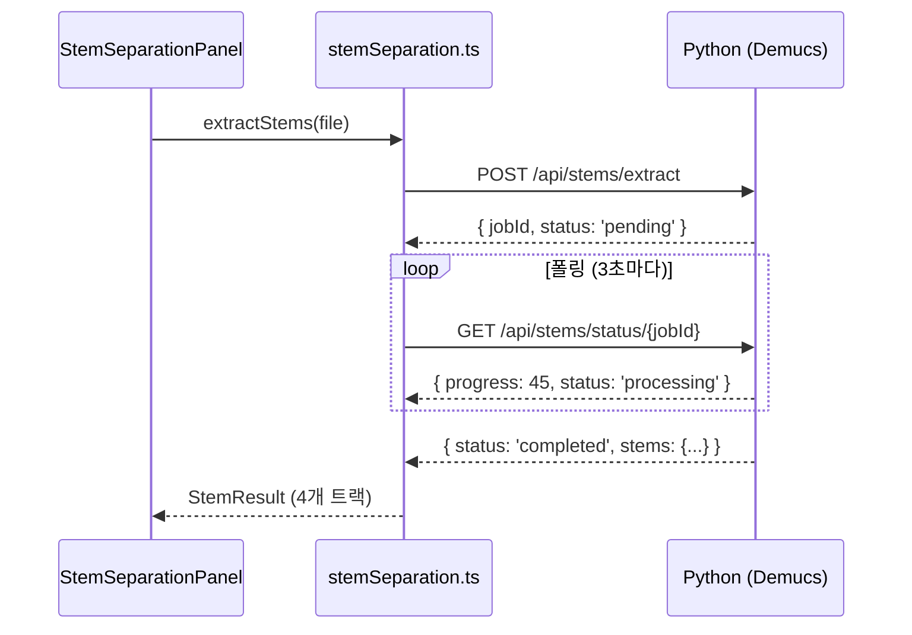
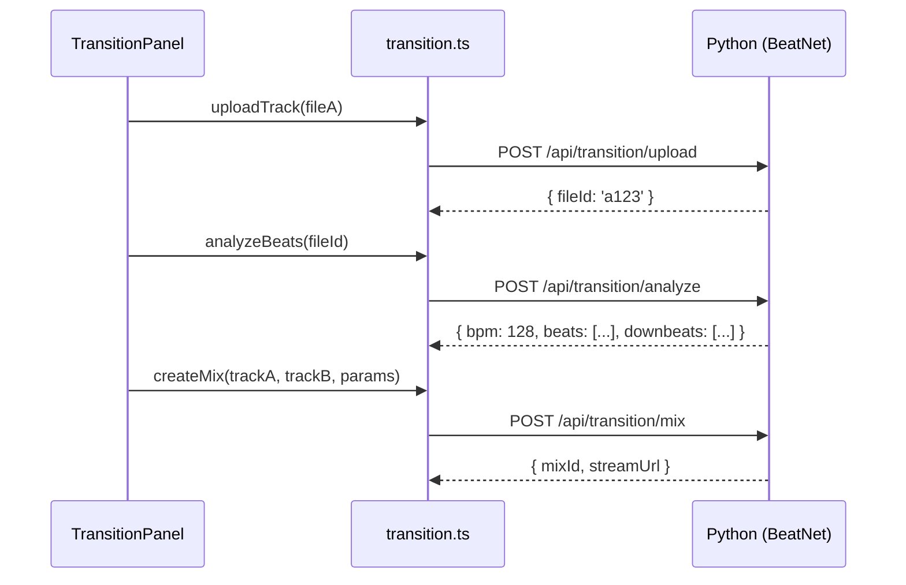

# Backend API 연동 가이드

> **목적:** 프론트엔드와 Python 백엔드 연결 방법 상세 가이드
> **최종 수정:** 2026-02-03

---

## 🔧 환경 설정

### 환경 변수 (.env.local)

```env
# Stem Separation API (Demucs)
NEXT_PUBLIC_STEM_API_URL=http://localhost:8000/api/stems

# Transition API (BeatNet, Madmom)
NEXT_PUBLIC_TRANSITION_API_URL=http://localhost:8000/api/transition

# SoundCloud API
NEXT_PUBLIC_SOUNDCLOUD_CLIENT_ID=your_client_id

# Mock 모드 (백엔드 미연결 시 true)
NEXT_PUBLIC_USE_MOCK=true
```

---

## 📡 API 클라이언트 위치

| 파일                        | 용도                    |
| --------------------------- | ----------------------- |
| `lib/api/stemSeparation.ts` | Demucs Stem 분리        |
| `lib/api/transition.ts`     | BeatNet/Madmom 트랜지션 |
| `lib/api/soundcloud.ts`     | SoundCloud 검색/로드    |

---

## 🎵 Stem Separation API

### 요청 흐름



### Mock → 실제 전환 코드

```typescript
// lib/api/stemSeparation.ts
export async function extractStems(
  file: File,
  options?: ExtractOptions,
): Promise<StemJobResponse> {
  const useMock = process.env.NEXT_PUBLIC_USE_MOCK === "true";

  if (useMock) {
    // 개발용 Mock 데이터 반환
    return mockExtractStems(file);
  }

  // 실제 API 호출
  const formData = new FormData();
  formData.append("file", file);
  formData.append(
    "stems",
    JSON.stringify(["drums", "bass", "vocals", "instruments"]),
  );
  formData.append("model", options?.model || "htdemucs");

  const response = await fetch(`${STEM_API_URL}/extract`, {
    method: "POST",
    body: formData,
  });

  return response.json();
}
```

---

## 🔀 Transition API

### 요청 흐름



### AI 파라미터 인터페이스

```typescript
interface TransitionParams {
  trackA: {
    fileId: string;
    startTime: number; // 믹스 시작 지점 (초)
    endTime: number;
  };
  trackB: {
    fileId: string;
    startTime: number;
    endTime: number;
  };
  transitionType: "blend" | "drop"; // Blend: 크로스페이드, Drop: 하드컷
  transitionDuration: number; // 초 단위 (4/8/16/32 bars 환산)
  syncBpm: boolean; // BPM 동기화 여부
  targetBpm?: number; // 목표 BPM (없으면 자동)
}
```

---

## 🔊 SoundCloud API

### 검색 및 로드

```typescript
// lib/api/soundcloud.ts
export async function searchTracks(query: string): Promise<SoundCloudTrack[]> {
  const clientId = process.env.NEXT_PUBLIC_SOUNDCLOUD_CLIENT_ID;

  const response = await fetch(
    `https://api.soundcloud.com/tracks?q=${encodeURIComponent(query)}&client_id=${clientId}`,
  );

  return response.json();
}

export async function getStreamUrl(trackId: string): Promise<string> {
  const clientId = process.env.NEXT_PUBLIC_SOUNDCLOUD_CLIENT_ID;

  // SoundCloud는 직접 스트리밍 URL 제공
  return `https://api.soundcloud.com/tracks/${trackId}/stream?client_id=${clientId}`;
}
```

---

## 📝 백엔드 개발자를 위한 체크리스트

### Stem Separation (Demucs)

- [ ] POST `/api/stems/extract` - 파일 업로드 + 분리 시작
- [ ] GET `/api/stems/status/{jobId}` - 진행 상태 조회
- [ ] GET `/api/stems/stream/{fileId}` - 스템 오디오 스트리밍
- [ ] GET `/api/stems/download/{jobId}/{stem}` - 다운로드

### Transition (BeatNet/Madmom)

- [ ] POST `/api/transition/upload` - 파일 업로드
- [ ] POST `/api/transition/analyze` - 비트/BPM 분석
- [ ] POST `/api/transition/mix` - 트랜지션 믹스 생성
- [ ] GET `/api/transition/stream/{mixId}` - 믹스 스트리밍

### 공통

- [ ] GET `/api/health` - 서비스 상태 확인
- [ ] CORS 헤더 설정 (`Access-Control-Allow-Origin: *`)

---

**작성자:** AI Assistant  
**버전:** 1.0
