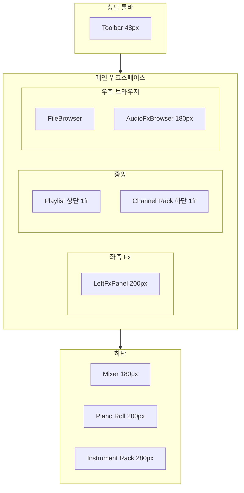

# Sonar 스타일 DAW 상세 명세서

> **프로젝트**: AI Audio Mixing & Conversion System  
> **작성일**: 2026-01-31  
> **버전**: 1.0  
> **목적**: (1) 현재 구현된 UI/기능의 구조·함수별 정리, (2) Figma AI·v0용 화면/컴포넌트 프롬프트, (3) Cakewalk Sonar 모방을 위한 필요 기능·조작·외관 체크리스트.  
> **기준 문서**: [PROJECT_PLAN.md](./PROJECT_PLAN.md), [FILE_STRUCTURE.md](./FILE_STRUCTURE.md), [API_SPEC.md](./API_SPEC.md). 본 명세서는 위 3개 공식 문서를 보조하는 UI/구현·Sonar 대비 상세 명세이다.

---

## 목차

1. [프로젝트 개요](#1-프로젝트-개요)
2. [화면 레이아웃 (Sonar 스타일)](#2-화면-레이아웃-sonar-스타일)
3. [컴포넌트·함수별 명세 (현재 구현)](#3-컴포넌트함수별-명세-현재-구현)
4. [스토어·훅·API 요약](#4-스토어훅api-요약)
5. [Cakewalk Sonar 대비 필요 기능 목록](#5-cakewalk-sonar-대비-필요-기능-목록)
6. [Figma AI / v0용 프롬프트](#6-figma-ai--v0용-프롬프트)
7. [데이터 구조 요약](#7-데이터-구조-요약)
8. [문서 버전·변경 이력](#8-문서-버전변경-이력)

---

## 1. 프로젝트 개요

- **기술 스택**: React 19, Vite 6, Tone.js 15, Zustand 5, react-router-dom 7.
- **엔트리**: `client/index.html` → `/src/main.jsx` (동적 import), `App.jsx`에서 Routes 정의.
- **빌드**: `vite build` → `client/dist`, `/api` 프록시는 `vite.config.js`에서 `localhost:3001`로 설정.
- **라우트**: `/` MainPage, `/studio` StudioPage(메인 DAW), `/dev` DevNavPage.

---

## 2. 화면 레이아웃 (Sonar 스타일)

### 2.1 영역 다이어그램

### 2.2 영역별 치수 및 역할

| 영역 | CSS 클래스 | 치수 | 역할 |
|------|------------|------|------|
| 상단 툴바 | `topPanel` | 높이 48px | 재생/정지, BPM, 로고 |
| 좌측 Fx | `leftFxColumn` | 너비 200px | 선택 채널 EQ·이펙트 슬롯 |
| 중앙 | `centerColumn` | flex: 1 | 위: Playlist, 아래: Channel Rack (2단 그리드) |
| 우측 브라우저 | `browserColumn` | 너비 260px | 위: 파일/샘플, 아래: Audio Fx 목록 |
| 믹서 | `consoleSection` | 높이 180px | Insert 스트립, 페이더, M/S/R/W/I |
| 피아노 롤 | `pianoRollSection` | 높이 200px | 노트 그리드 편집 |
| 인스트루먼트 랙 | `instrumentRackSection` | 높이 280px (max) | 신스 피아노 키보드·악기 선택 |

### 2.3 Figma / v0용 레이아웃 문장

- **전체**: "DAW 단일 화면. 배경 #1a1a1a, 텍스트 #e0e0e0. 상단 48px 툴바, 본문은 좌 200px / 중앙 가변 / 우 260px 3열, 하단 180px 믹서 + 200px 피아노 롤 + 280px 인스트루먼트 랙."
- **툴바**: "상단 48px, 배경 #2b2b2b. 왼쪽 PLAY·STOP 버튼, BPM 숫자 입력, 오른쪽 로고."
- **좌측 패널**: "너비 200px. 헤더 'Fx'. 채널 선택 시 4밴드 EQ(Gain/Freq/Q) + HP/LP + '+ FX' 버튼."
- **중앙**: "2단 그리드. 위: Playlist(트랙 헤더 M/S + 클립 타임라인). 아래: Channel Rack(패턴명 + 채널별 16스텝 시퀀서)."
- **우측**: "260px. 위: 폴더/파일 목록(드래그 가능). 아래: Audio Fx 검색·카테고리 목록."
- **믹서**: "가로 스크롤. 채널 스트립: Post FX, Sends, 미터, 볼륨 슬라이더(-60~6 dB), M/S/R/W/I, In/Out."
- **피아노 롤**: "왼쪽 키 레이블(흑백), 오른쪽 그리드(스텝×피치), 노트 블록 배치."
- **인스트루먼트 랙**: "악기 선택 드롭다운, 옥타브 ±, 메트로놈·녹음·Arp·Sequencer, 피아노 키보드."

---

## 3. 컴포넌트·함수별 명세 (현재 구현)

### 3.1 Toolbar

- **역할**: 전역 재생/정지·BPM 표시 및 입력.
- **파일**: `client/src/components/Studio/Toolbar/Toolbar.jsx`
- **State/Store**: `isPlaying`, `bpm`, `setBpm` (useProjectStore), `togglePlay`, `stop` (useTransport).
- **주요 함수**:
  - `togglePlay`: useTransport의 togglePlay 호출 → store `isPlaying` 토글, Tone.Transport.start/stop.
  - `stop`: Transport 정지 및 position 0.
  - `setBpm(Number(e.target.value))`: store BPM 갱신 (useEffect로 Tone.Transport.bpm 동기).
- **UI 요소**: PLAY/PAUSE 버튼, STOP 버튼, BPM 라벨, number input, 로고 텍스트.

---

### 3.2 AudioEngine

- **역할**: 플레이리스트 클립에 따라 Tone.Transport.schedule로 패턴(스텝+노트) 재생 스케줄링. 채널별 악기(Tone.Player/PolySynth) 생성·관리.
- **파일**: `client/src/components/Studio/AudioEngine/AudioEngine.jsx`
- **State/Store**: `channels`, `patterns`, `activePatternId`, `playlist` (tracks, clips).
- **Refs**: `instrumentsRef` (channelId → Player|Synth), `sequencesRef`, `partRef`, `scheduleIdsRef`.
- **주요 로직**:
  - useEffect(channels): 채널별 Tone.Player(url) 또는 PolySynth(Synth 타입) 생성, volume = ch.vol; 삭제된 채널 dispose.
  - useEffect(playlist, patterns, channels): 기존 schedule clear 후, `playlist.clips` 순회. `clip.type === 'pattern'`이면 `Tone.Transport.schedule(time => { ... }, timeFormat)`에서 pattern.channels 스텝별 triggerAttackRelease/Player.start, pattern.notes는 channelId 5(Piano)로 triggerAttackRelease.
  - audio 클립 재생: 미구현.
- **UI**: 없음 (`return null`).

---

### 3.3 LeftFxPanel

- **역할**: Sonar 스타일 좌측 Fx 패널. 선택된 Insert에 대한 EQ·이펙트 슬롯 UI.
- **파일**: `client/src/components/Studio/LeftFxPanel/LeftFxPanel.jsx`
- **State/Store**: `selectedInsertId` (useProjectStore). EQ 값은 로컬 기본값만 사용(store/Tone 미연동).
- **상수**: `EQ_BANDS`: low, lomid, himid, high (각 Gain/Freq/Q range input).
- **UI 요소**: 헤더 "Fx", selectedInsertId 있을 때 4밴드 EQ(밴드당 Gain/Freq/Q 슬라이더), HP/LP 슬라이더, "+ FX" 버튼. 없을 때 placeholder 문구.

---

### 3.4 FileBrowser

- **역할**: 파일/샘플 폴더 목록 표시, 드래그로 Playlist 등에 전달.
- **파일**: `client/src/components/Studio/Browser/FileBrowser.jsx`
- **State**: `folders` (useState, MOCK_FOLDERS). 폴더별 isOpen 토글.
- **주요 함수**:
  - `toggleFolder(index)`: 해당 폴더 isOpen 토글.
  - `handleDragStart(e, file)`: `e.dataTransfer.setData('application/json', JSON.stringify(file))`, file = { id, name, type, url }.
- **UI 요소**: 헤더 "BROWSER", 폴더 행(토글 아이콘+이름), 파일 행(draggable, 아이콘+이름). API 연동 없음.

---

### 3.5 AudioFxBrowser

- **역할**: Sonar 스타일 Audio Fx 플러그인 브라우저 목록 UI (실제 플러그인 로드는 미구현).
- **파일**: `client/src/components/Studio/Browser/AudioFxBrowser.jsx`
- **State**: `search` (useState).
- **상수**: `MOCK_CATEGORIES` (Cakewalk, iZotope 등 문자열 배열).
- **UI 요소**: 헤더 "Audio Fx", 검색 input, 카테고리 리스트, 푸터 "Plug-ins".

---

### 3.6 ChannelRack

- **역할**: 패턴명 표시 및 채널 목록 컨테이너.
- **파일**: `client/src/components/Studio/ChannelRack/ChannelRack.jsx`
- **State/Store**: `channels`, `patternName` = patterns[activePatternId].name.
- **UI 요소**: rackHeader(패턴명 + '+' 버튼, 버튼 동작 없음), channelList → ChannelRow 매핑.

---

### 3.7 ChannelRow

- **역할**: 한 채널의 볼륨/팬 컨트롤 + StepSequencer.
- **파일**: `client/src/components/Studio/ChannelRack/ChannelRow.jsx`
- **Props**: `channel` (id, name, type, url, vol, pan).
- **State/Store**: `vol`, `pan`, `setChannelVolume`, `setChannelPan` (useShallow).
- **주요 함수**: `handleVolChange`: vol 토글(0 ↔ -6) 데모. Pan은 store 반영만, UI 드래그 없음.
- **UI 요소**: 볼륨 knob(클릭 시 handleVolChange), 팬 knob, 채널명, StepSequencer.

---

### 3.8 StepSequencer

- **역할**: 16스텝 그리드, 클릭 시 스텝 토글.
- **파일**: `client/src/components/Studio/ChannelRack/StepSequencer.jsx`
- **Props**: `channelId`.
- **State/Store**: `steps` = patterns[activePatternId].channels[channelId], `toggleStep`.
- **주요 함수**: `toggleStep(channelId, index)` (mouseDown): store에서 해당 스텝 boolean 토글.
- **UI 요소**: 16개 stepButton, 활성 시 stepButtonActive 클래스.

---

### 3.9 PianoRoll

- **역할**: 멜로디 노트 그리드 편집. 클릭으로 노트 추가, 노트 클릭으로 삭제.
- **파일**: `client/src/components/Studio/PianoRoll/PianoRoll.jsx`
- **상수**: NOTE_HEIGHT 20, STEP_WIDTH 40, NOTES, OCTAVES [6,5,4,3], KEYS(피치 레이블).
- **State/Store**: `activePatternId`, `notes`, `length`, `addNote`, `removeNote`.
- **주요 함수**:
  - `handleGridClick(e)`: 클릭 위치 → stepIndex, keyIndex. timeStr "0:quarter:sixteenth", newNote { id, channelId: 5, note, time, duration: '16n', step, keyIndex }. addNote(activePatternId, newNote).
  - `handleNoteClick(e, noteId)`: removeNote(activePatternId, noteId).
- **UI 요소**: keysContainer(피치 레이블), gridContainer(스크롤, 배경 그리드), 키 오버레이(좌측 고정), 노트 div(위치/너비).

---

### 3.10 Playlist

- **역할**: 트랙 헤더(M/S) + 클립 타임라인. 더블클릭으로 패턴 클립 추가, 드래그앤드롭으로 파일 업로드·AI 분리·스템 클립 추가.
- **파일**: `client/src/components/Studio/Playlist/Playlist.jsx`
- **상수**: BAR_WIDTH 60.
- **State/Store**: `tracks`, `clips`, `inserts`, `addClip`, `removeClip`, `toggleMute`, `toggleSolo`.
- **주요 함수**:
  - `handleTrackDoubleClick(trackId, e)`: 클릭 x → startBar, addClip({ type: 'pattern', patternId: 1, start: startBar, duration: 4, trackId }).
  - `handleClipClick(e, clipId)`: removeClip(clipId).
  - `handleDragOver`, `handleDrop`: application/json이면 브라우저 내 파일 → startBar/trackIndex 계산 후 addClip(audio). files면 uploadSound → splitLayers → 4개 stem 클립 addClip.
- **UI 요소**: header(Playlist, Paint/Slice 버튼 무동작), trackHeaders(이름, M, S), 트랙 행(더블클릭 영역), 클립 div(위치/너비, stemType별 클래스).

---

### 3.11 Mixer

- **역할**: Insert 스트립 나열. 볼륨·M/S·R/W/I·In/Out. 채널 클릭 시 selectedInsertId 설정.
- **파일**: `client/src/components/Studio/Mixer/Mixer.jsx`
- **State/Store**: `inserts`, `setMixerVolume`, `setSelectedInsertId`, `toggleMute`, `toggleSolo`.
- **Refs**: `meterRefs` (미터 DOM, Tone.Meter 미연동).
- **주요 함수**: `handleVolume(id, e)`: setMixerVolume(id, parseFloat(e.target.value)).
- **UI 요소**: channelStrip(insert 0은 masterStrip). Per strip: fxRow(Post, FX 버튼), sendsRow, meterContainer(meterLevel 고정 30%), volumeSlider(-60~6), msrwiRow(M/S/R/W/I), ioRow(In/Out select), stripHeader(이름).

---

### 3.12 CompositionKeyboard (SynthPiano)

- **역할**: Studio Instrument Rack. 가상 피아노 키보드, 악기 선택, 옥타브, 메트로놈, 녹음, Arp, Step Sequencer 오버레이.
- **파일**: `client/src/components/CompositionKeyboard/CompositionKeyboard.jsx`
- **Props**: padId, previewMode, type, preset, instrumentManager, onClose, embedded.
- **State**: octaveShift(-2~+2), pressedKeys, showSequencer, isRecording, instrumentType, isDragging. Store: bpm, setBpm, isMetronomeOn, setIsMetronomeOn.
- **주요 함수**:
  - `buildKeyLayout`: ivoryKeys/ebonyKeys 생성(옥타브 반영).
  - `triggerKey(note)`, `releaseKey(note)`: instrumentManager.startNote/stopNote, 녹음 중이면 recordedNotesRef 기록.
  - `handleInstrumentChange(e)`: setInstrumentType, instrumentManager.setInstrument(type).
  - `toggleRecording`: startRecording/stopRecording → uploadPianoRecord(uploadFile) → triggerLibraryRefresh.
  - `handleMouseDown`: 드래그 시작(embedded 시 미사용). 키보드: ArrowUp/Down 옥타브, 문자키→triggerKey/releaseKey, Escape→onClose.
- **UI 요소**: controlBar(악기 select, 옥타브 ±, ArpeggiatorControl, Show Sequencer, 메트로놈, 녹음, CLOSE), StepSequencer 조건부, keyboardWrapper(흑백 키).

---

### 3.13 AppLayout

- **역할**: 앱 공통 레이아웃. Outlet만 렌더, 배경 #1a1a1a.
- **파일**: `client/src/components/Layout/AppLayout.jsx`
- **UI**: div(style width 100%, minHeight 100vh, background #1a1a1a), Outlet.

---

### 3.14 ErrorBoundary

- **역할**: 자식 컴포넌트 에러 포착 시 폴백 UI.
- **파일**: `client/src/components/common/ErrorBoundary.jsx`
- **State**: hasError, error. getDerivedStateFromError, componentDidCatch.
- **UI**: 에러 시 "Something went wrong.", error 메시지, Reload 버튼.

---

### 3.15 LoadingSpinner

- **역할**: 로딩 중 스피너·텍스트.
- **파일**: `client/src/components/common/LoadingSpinner.jsx`
- **Props**: text (기본 "Loading...").
- **UI**: spinnerContainer, spinner div, p(text).

---

## 4. 스토어·훅·API 요약

### 4.1 useProjectStore (Zustand + Immer)

- **위치**: `client/src/store/useProjectStore.js`
- **상태**: isPlaying, bpm, currentTime, isMetronomeOn, selectedTrackId, selectedInsertId, activePatternId, patterns{ 1: { id, name, length, channels{ 1..4: [16 bool] }, notes[] } }, channels[ { id, name, type, url, vol, pan } ], playlist{ tracks[], clips[] }, mixer{ inserts[] }.
- **액션**: setMixerVolume(insertId, val), toggleMute(insertId), toggleSolo(insertId), addClip(clip), removeClip(clipId), addNote(patternId, note), removeNote(patternId, noteId), setIsPlaying, setBpm, setIsMetronomeOn, triggerLibraryRefresh, setSelectedTrackId, setSelectedInsertId, toggleStep(channelId, stepIndex), setChannelVolume(id, val), setChannelPan(id, val).

### 4.2 useTransport

- **위치**: `client/src/hooks/useTransport.js`
- **입력**: store isPlaying, bpm.
- **동작**: BPM → Tone.Transport.bpm. isPlaying → Tone.start() 후 Transport.start/stop.
- **반환**: togglePlay(), stop() (position 0).

### 4.3 useUploadProgress

- **위치**: `client/src/hooks/useUploadProgress.js`
- **상태**: progress, isUploading, error.
- **함수**: startUpload, updateProgress, finishUpload, failUpload, uploadFile(apiFn, ...args) — apiFn 호출 후 진행/완료/실패 처리.

### 4.4 audioApi.js

- **resolveMusicUrl(path)**: 상대 경로 → 풀 URL (BASE_URL 기준).
- **uploadSound(file, title, artist, onProgress)**: POST /api/sound/upload, XHR upload progress.
- **splitLayers(trackId)**: POST /api/sound/split.
- **createBlend(sourceId, targetId, blendPoint)**: POST /api/sound/blend.
- **uploadPianoRecord(opts)**: POST /api/piano/upload (file, title, notes).
- **uploadSample(file)**: POST /api/sample/upload.
- **참고**: API_SPEC에는 POST /api/sound/inspect(트랙 분석 재실행)도 정의되어 있으나, 현재 클라이언트에서는 미호출.

### 4.5 instrumentManager (싱글톤)

- **위치**: `client/src/utils/instrumentManager.js`
- **메서드**: initialize() (Tone.start, PolySynth, Sampler, MediaStreamDestination, Recorder), setInstrument(type), loadPreview/closePreview, startPreviewNote/stopPreviewNote, startNote/stopNote, startRecording/stopRecording → blob. get isPianoReady.

---

## 5. Cakewalk Sonar 대비 필요 기능 목록

| 구분 | 항목 | 현재 상태 | 목표 동작 |
|------|------|-----------|-----------|
| Track View | Navigator 패널 | 없음 | 전체 프로젝트 미니맵, Now Time 표시, 줌 영역 드래그 |
| Track View | Time Ruler | 없음 | Bar/Beat 눈금, 클릭 시 Now Time 이동 |
| Track View | Track Pane | 부분 | 트랙 스트립·미터, 선택 트랙 강조 |
| Track View | Clips Pane | 있음 | 클립 선택/이동/스냅, 더블클릭 동작 확장 |
| Track View | Bus Pane | 없음 | 버스 목록·패치 |
| Track View | Track Inspector | 부분 | LeftFxPanel = 선택 채널 상세; I 키 토글, Sonar 스타일 컨트롤 확장 |
| 표시 | 클립 이름/내용 | 부분 | 클립 이름 있음, 웨이브/내용 표시 옵션 없음 |
| 표시 | Vertical Grid | 없음 | None/Behind/In Front 옵션 |
| 표시 | Ghosted Data | 없음 | 비선택 데이터 타입 반투명 |
| Clips | 더블클릭 MIDI | 없음 | Piano Roll / Staff / Event List 열기 |
| Clips | 더블클릭 Audio | 없음 | Clip Properties / Loop Construction |
| Clips | 스냅 오프셋 | 없음 | 스냅 그리드·오프셋 설정 |
| Clips | 크로스페이드 | 없음 | 클립 간 페이드 |
| Clips | Ripple Edit | 없음 | 하류 클립 자동 이동 |
| 트랙 | 추가/삭제/숨김 | 없음 | Track Manager, 정렬, I/O 할당 |
| 트랙 | Bounce to Track | 없음 | 선택 트랙 병합 |
| Mixer | 버스 | 없음 | 버스 삽입·패치 |
| Mixer | 미터 실시간 | 없음 | Tone.Meter 연동, Peak 표시 |
| Mixer | Insert FX 실제 | 없음 | 슬롯 클릭 시 이펙트 체인 편집·Tone 연동 |
| Transport | Now Time 표시/이동 | 없음 | 루퍼/타임라인에 재생 헤드, 클릭 이동 |
| Transport | 루프 구간 | 없음 | Loop Start/End |
| Transport | 메트로놈 소리 | 없음 | BPM 연동 클릭 소리 |
| 키보드 | 트랙/컨트롤 이동 | 없음 | 화살표로 트랙·컨트롤 포커스 |
| 키보드 | 단축키 표 | 없음 | Sonar 스타일 단축키 문서·UI |

---

## 6. Figma AI / v0용 프롬프트

- **전체 DAW 프레임**: "Single-page DAW layout, dark theme #1a1a1a, text #e0e0e0. Top bar 48px, left panel 200px, center flexible, right panel 260px. Bottom: mixer 180px, piano roll 200px, instrument rack 280px."
- **툴바**: "Transport bar: Play button, Stop button, BPM number input, logo text. Height 48px, background #2b2b2b."
- **좌측 Fx**: "Left panel 200px: header 'Fx'. When channel selected: 4-band EQ with Gain/Freq/Q sliders per band, HP/LP filters, '+ FX' button. Placeholder when none selected."
- **Playlist**: "Track headers with name and M/S buttons. Timeline grid, draggable clips. Bar width 60px, track height 60px. Clips show name, pattern vs audio styling."
- **Channel Rack**: "Pattern name at top, '+' button. Rows: each row has channel name, volume knob, pan knob, 16-step grid. Step cells toggle on click, active state highlighted."
- **피아노 롤**: "Left: piano key labels (white/black). Right: scrollable grid, step width 40px, note height 20px. Note blocks positioned by step and pitch, click to add, click note to delete."
- **믹서**: "Horizontal strip per channel. Each: Post FX label, Sends, vertical meter, volume fader (-60 to 6 dB), M/S/R/W/I buttons, In/Out dropdowns, channel name. Master strip distinct."
- **인스트루먼트 랙**: "Instrument dropdown (Synth, FM, AM, Membrane, etc.), octave +/- buttons, metronome button, record button, sequencer toggle. Piano keyboard: two rows of keys (ivory/ebony), responsive to click and key press."
- **16스텝 시퀀서**: "16 cells in a row. Click toggles cell on/off. Active cell uses accent color. Used per channel row in channel rack."

---

## 7. 데이터 구조 요약

- **patterns**: `{ [id]: { id, name, length, channels: { [channelId]: boolean[16] }, notes: [{ id, channelId, note, time, duration, step?, keyIndex? }] } }`
- **channels**: `[{ id, name, type, url?, vol, pan }]`
- **playlist**: `{ tracks: [{ id, name }], clips: [{ id?, type: 'pattern'|'audio', start, duration, trackId, patternId?, url?, name?, stemType?, isProcessing? }] }`
- **mixer**: `{ inserts: [{ id, name, vol, pan, mute, solo, effects }] }`

---

## 8. 문서 버전·변경 이력

**문서 버전**: 1.0  
**최종 수정일**: 2026-01-31  
**변경 이력**: v1.0 — Sonar 스타일 DAW 상세 명세서 최초 작성. 프로젝트 개요, 화면 레이아웃, 컴포넌트·함수별 명세, 스토어·훅·API, Sonar 대비 필요 기능, Figma/v0 프롬프트, 데이터 구조 수록.
